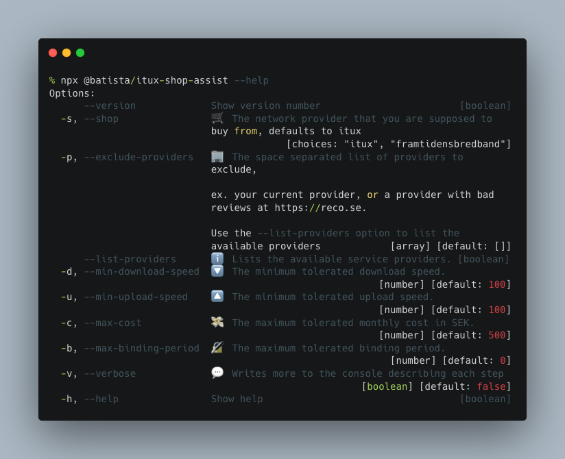

# Itux / Framtidensbredband Shop Assistant CLI

[](https://github.com/batista/itux-shop-assist/actions?query=workflow%3Abuild-test+branch%3Amaster)
[](https://github.com/batista/itux-shop-assist/actions?query=workflow%3ACodeQL+branch%3Amaster)
[](https://github.com/batista/itux-shop-assist/actions/workflows/codacy-analysis.yml)
[](https://www.codacy.com/gh/batista/itux-shop-assist/dashboard?utm_source=github.com&amp;utm_medium=referral&amp;utm_content=batista/itux-shop-assist&amp;utm_campaign=Badge_Grade)
[](https://www.codacy.com/gh/batista/itux-shop-assist/dashboard?utm_source=github.com&amp;utm_medium=referral&amp;utm_content=batista/itux-shop-assist&amp;utm_campaign=Badge_Coverage)
[](https://github.com/batista/itux-shop-assist/blob/main/LICENSE)

If you are like me and is always trying to snatch the best campaign (I do it every time the previous campaign expires), but feel the filtering options provided to you are not the best, then this CLI helper tool is for you.


**NOTE: This CLI is targeted to users of [itux.se](https://www.itux.se) and [framtidensbredband.se](https://www.framtidensbredband.se) only.**

## Usage

To use with the default options:

```bash
npx @batista/itux-shop-assist
```

### ❔ Help

To get the available options append the `--help` (`-h`) option.

```bash
npx @batista/itux-shop-assist --help
```




---

### 🛒 Different supported stores

#### Itux (default)

**If you are a user of [itux.se](https://www.itux.se), then you don't have to do anything.**

If you're stubborn and still want to force the store, then you can always use the `--shop itux` option.

```bash
npx @batista/itux-shop-assist --shop itux
```

#### Framtidens Bredband

If you are a user of [framtidensbredband.se](https://www.framtidensbredband.se), you need to append the `--shop` (`-s`) option to get the right offers.

```bash
npx @batista/itux-shop-assist --shop framtidensbredband
```

---

### 🚫 Exclude Certain Providers

If for some reason you want to exclude a certain provider, for example you have read some bad reviews.

The `--exclude-providers` (`-p`) option along with `<provider-key>` allows you to exclude certain providers.

You should pass a list of provider-keys that you can retrieve with the `--list-providers` option.

```bash
npx @batista/itux-shop-assist --exclude-providers provider-key-1 provider-key-2
```

#### List the Provider Keys

To populate the `--exclude-providers` parameter, you need to first know the keys, you get those with the `--list-providers` flag. This cuts the application short and will retrieve only the list of providers.

```bash
npx @batista/itux-shop-assist --list-providers
```

---

### 💬 Verbose

If you want to know what is happening in the background, I have just the option for you: `--verbose` (`-v`).

```bash
npx @batista/itux-shop-assist --verbose
```

---

### 🔽  Minimum Download Speed

We all have our requirements, maybe you can live with just 10Mbit/s at the summer house, but at home you'll need that snappy 1000Mbit/s to browse your favorite newspaper.

The `--min-download-speed` (`-d`) option allows you to specify your minimum tolerated speed (in MBits/s).

```bash
npx @batista/itux-shop-assist --min-download-speed 100
```

---

### 🔼  Minimum Upload Speed

If you need to upload your favorite pictures super fast to Instagram, then you'll need a good upload speed, the `--min-upload-speed` (`-u`) option allows you to specify your minimum tolerated speed (in MBits/s).

```bash
npx @batista/itux-shop-assist --min-upload-speed 100
```

---

### 💸 Maximum Monthly Cost

We don't just care about the campaign prices, *what if we forget to cancel in time?!*

The `--max-cost` (`-c`) option allows you to specify your maximum tolerated monthly cost (in SEK).

```bash
npx @batista/itux-shop-assist --max-cost 500
```

---

### 🔏 Maximum Binding Period

Now, they might attract you with great campaigns, but if you don't notice the details, you might be in for the long term with your new supplier. The whole purpose of this app is to be able to switch to the next optimum provider when the current campaign hits its end, so you can save for those lovely new shoes you saw at the store the other day 👠 .

The `--max-binding-period` (`-b`) option allows you to specify your maximum tolerated binding period (in months).

```bash
npx @batista/itux-shop-assist --max-binding-period 1
```

---

### 📆 Maximum Cancellation Period

How soon can you get out of your contract once you have decided to do so?

The `--max-cancellation-period` (`--cp`) option allows you to specify your maximum tolerated cancellation period (in months).

```bash
npx @batista/itux-shop-assist --max-cancellation-period 1
```
